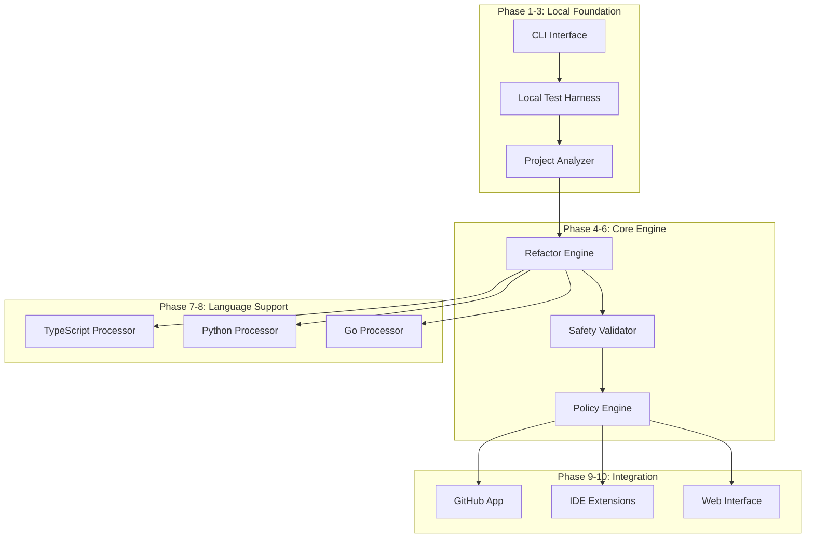
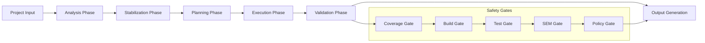

# Refactogent Unified Implementation - Design Document

## Overview

Refactogent is designed as a modular, safety-first refactoring system that can operate in multiple modes: local-only CLI, IDE integration, and GitHub App. The architecture prioritizes incremental development and testing, starting with robust local capabilities before expanding to collaborative features.

The system follows a pipeline architecture where each stage has clear inputs, outputs, and validation gates. This design ensures that failures are caught early and that the system can be tested and validated at each phase of development.

## Architecture

### High-Level System Architecture



### Core Pipeline Architecture



## Components and Interfaces

### 1. Project Analyzer

**Purpose:** Analyzes project structure, dependencies, and safety characteristics.

**Key Interfaces:**
```typescript
interface ProjectAnalyzer {
  analyzeProject(projectPath: string): Promise<ProjectAnalysis>;
  generateSafetyScore(analysis: ProjectAnalysis): SafetyScore;
  identifyPublicSurfaces(analysis: ProjectAnalysis): PublicSurface[];
}

interface ProjectAnalysis {
  languages: LanguageInfo[];
  dependencies: DependencyGraph;
  testCoverage: CoverageReport;
  publicSurfaces: PublicSurface[];
  riskFactors: RiskFactor[];
}
```

### 2. Test Harness System

**Purpose:** Provides isolated testing environments for different project types.

**Key Interfaces:**
```typescript
interface TestHarness {
  createTestEnvironment(projectType: ProjectType): TestEnvironment;
  runRefactoringTest(test: RefactoringTest): TestResult;
  validateSafety(before: ProjectState, after: ProjectState): SafetyResult;
}

interface TestEnvironment {
  projectPath: string;
  containerConfig: ContainerConfig;
  toolchains: ToolchainConfig[];
}
```

### 3. Refactoring Engine

**Purpose:** Core refactoring logic with AST-based transformations.

**Key Interfaces:**
```typescript
interface RefactoringEngine {
  planRefactoring(request: RefactoringRequest): RefactoringPlan;
  executeRefactoring(plan: RefactoringPlan): RefactoringResult;
  validateTransformation(transformation: ASTTransformation): ValidationResult;
}

interface RefactoringPlan {
  transformations: ASTTransformation[];
  affectedFiles: string[];
  riskAssessment: RiskAssessment;
  rollbackPlan: RollbackPlan;
}
```

### 4. Safety Validator

**Purpose:** Comprehensive validation of refactoring safety.

**Key Interfaces:**
```typescript
interface SafetyValidator {
  runCharacterizationTests(project: Project): CharacterizationResult;
  validateSemanticEquivalence(before: ProjectState, after: ProjectState): SEMResult;
  checkCoverageRegression(before: Coverage, after: Coverage): CoverageResult;
}

interface CharacterizationResult {
  httpRoutes: GoldenTest[];
  cliCommands: GoldenTest[];
  libraryFunctions: GoldenTest[];
  coverage: number;
}
```

### 5. Policy Engine

**Purpose:** Enforces project-specific policies and constraints.

**Key Interfaces:**
```typescript
interface PolicyEngine {
  loadPolicy(configPath: string): Policy;
  validateOperation(operation: RefactoringOperation, policy: Policy): PolicyResult;
  enforceGates(result: RefactoringResult, policy: Policy): GateResult[];
}

interface Policy {
  allowedModes: RefactoringMode[];
  protectedPaths: string[];
  coverageThresholds: CoverageThresholds;
  safetyGates: SafetyGate[];
}
```

## Data Models

### Core Data Structures

```typescript
// Project representation
interface Project {
  path: string;
  type: ProjectType;
  languages: Language[];
  config: ProjectConfig;
  metadata: ProjectMetadata;
}

// Refactoring operations
interface RefactoringOperation {
  type: RefactoringType;
  scope: OperationScope;
  parameters: OperationParameters;
  safetyLevel: SafetyLevel;
}

// Safety and validation
interface SafetyResult {
  passed: boolean;
  gates: GateResult[];
  artifacts: Artifact[];
  recommendations: string[];
}

// Test and coverage data
interface TestResult {
  passed: boolean;
  coverage: CoverageData;
  duration: number;
  artifacts: TestArtifact[];
}
```

### Configuration Models

```typescript
interface RefactogentConfig {
  version: string;
  modes: RefactoringMode[];
  languages: LanguageConfig[];
  safety: SafetyConfig;
  output: OutputConfig;
}

interface LanguageConfig {
  name: string;
  extensions: string[];
  buildCommand: string;
  testCommand: string;
  lintCommands: string[];
}
```

## Error Handling

### Error Classification

1. **User Errors:** Invalid configuration, unsupported project types
2. **System Errors:** Tool failures, resource constraints
3. **Safety Errors:** Failed validation gates, coverage regressions
4. **Integration Errors:** GitHub API failures, webhook issues

### Error Handling Strategy

```typescript
interface ErrorHandler {
  classifyError(error: Error): ErrorClassification;
  generateRecoveryPlan(error: ClassifiedError): RecoveryPlan;
  logError(error: ClassifiedError, context: OperationContext): void;
}

interface RecoveryPlan {
  canRecover: boolean;
  steps: RecoveryStep[];
  fallbackOptions: FallbackOption[];
}
```

### Failure Modes and Mitigations

- **Build Failures:** Rollback changes, provide build logs
- **Test Failures:** Identify failing tests, suggest fixes
- **Coverage Regression:** Block operation, suggest test additions
- **Policy Violations:** Explain violation, suggest alternatives
- **Resource Exhaustion:** Implement backoff, queue operations

## Testing Strategy

### Phase-Based Testing Approach

#### Phase 1-3: Foundation Testing
- Unit tests for core components
- Integration tests with sample projects
- Local test harness validation
- CLI interface testing

#### Phase 4-6: Engine Testing
- Refactoring operation tests
- Safety validation tests
- Policy enforcement tests
- Multi-language support tests

#### Phase 7-8: Language Testing
- Language-specific transformation tests
- Cross-language project tests
- Toolchain integration tests
- Performance benchmarks

#### Phase 9-10: Integration Testing
- GitHub App integration tests
- IDE extension tests
- End-to-end workflow tests
- Production readiness tests

### Test Categories

1. **Unit Tests:** Individual component functionality
2. **Integration Tests:** Component interaction testing
3. **System Tests:** Full pipeline testing
4. **Safety Tests:** Validation of safety guarantees
5. **Performance Tests:** Scalability and resource usage
6. **Regression Tests:** Prevention of known issues

### Test Data Management

```typescript
interface TestDataManager {
  createSampleProject(type: ProjectType): SampleProject;
  generateTestCases(operation: RefactoringType): TestCase[];
  validateTestResults(results: TestResult[]): ValidationSummary;
}

interface SampleProject {
  name: string;
  type: ProjectType;
  complexity: ComplexityLevel;
  hasTests: boolean;
  hasDebt: boolean;
}
```

## Implementation Phases

### Phase 1: Local Test Infrastructure (Foundation)
- Basic CLI structure
- Sample project generation
- Local test runner
- Basic project analysis

### Phase 2: Project Analysis Engine
- Language detection
- Dependency analysis
- Public surface identification
- Safety score calculation

### Phase 3: Characterization Test System
- HTTP route recording
- CLI command capture
- Library function testing
- Golden test generation

### Phase 4: Core Refactoring Engine
- AST parsing and transformation
- Symbol renaming
- Function extraction
- Import management

### Phase 5: Safety Validation System
- Build validation
- Test execution
- Coverage analysis
- Semantic equivalence checking

### Phase 6: Policy and Configuration
- YAML policy loading
- Gate enforcement
- Mode restrictions
- Path protection

### Phase 7: Multi-Language Support
- TypeScript integration
- Python support
- Go support
- Language-specific optimizations

### Phase 8: Advanced Refactoring Operations
- Complex transformations
- Cross-file refactoring
- Dead code elimination
- Code organization

### Phase 9: GitHub Integration
- GitHub App setup
- Webhook handling
- PR creation and management
- Status checks

### Phase 10: Production Features
- IDE extensions
- Web interface
- Monitoring and observability
- Performance optimization

## Security Considerations

### Authentication and Authorization
- GitHub App private key management
- Webhook signature verification
- Rate limiting and abuse prevention
- Audit logging

### Code Safety
- Sandboxed execution environments
- Input validation and sanitization
- Secret detection and redaction
- Rollback capabilities

### Data Protection
- Temporary file cleanup
- Secure artifact storage
- Privacy-preserving logging
- Compliance with data regulations

## Performance and Scalability

### Performance Targets
- Project analysis: < 30 seconds for typical projects
- Refactoring operations: < 5 minutes for single-file changes
- Test execution: < 10 minutes for full validation
- Memory usage: < 2GB for typical operations

### Scalability Considerations
- Horizontal scaling for multiple repositories
- Caching of analysis results
- Incremental processing
- Resource pooling and management

### Optimization Strategies
- Lazy loading of language processors
- Parallel execution where safe
- Caching of expensive operations
- Efficient diff algorithms